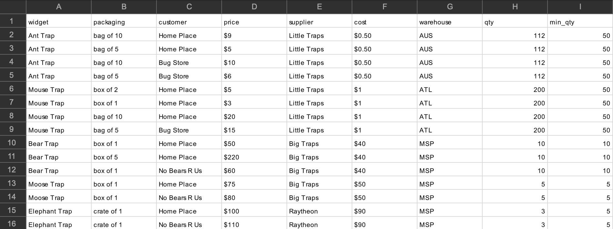

# challenge-widget-design

Given the data below

1) Create a basic system description and document a normalized schema from the widgets data above.  
2) what you think this system would do 
3) what you feel would be a reasonable database structure for the data and a reasonable architecture for the system 
4) any questions or concerns you have regarding this dataset/system that might need to be answered before establishing an ideal database/solution for such a system.